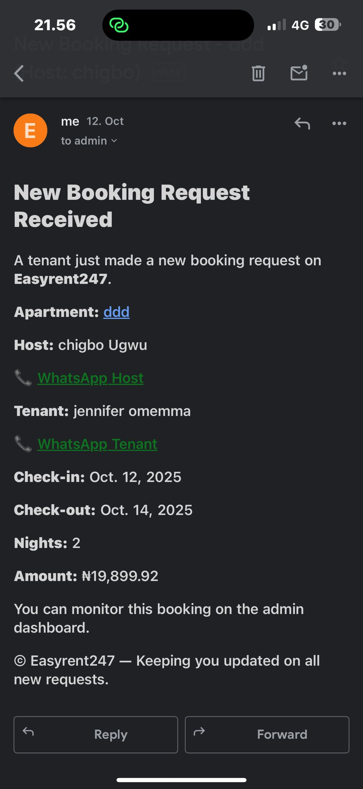

#  Automated Booking & Notification System

A Django automation project that manages apartment bookings and sends notifications automatically to both tenants and landlords.

---

##  Key Features
-  **Automated Email Confirmations** to tenants and landlords after each booking  
- **Scheduled Availability Updates** for apartments after check-ins/check-outs  
- **Background Task Scheduling** with **Celery** for smooth asynchronous operations  
-  **Reliable Data Management** using **PostgreSQL**  
-  **Error Logging & Retry Mechanism** for failed email deliveries  

---

## Tools & Libraries
- **Framework:** Django  
- **Task Queue:** Celery  
- **Language:** Python  
- **Database:** PostgreSQL  
- **Email Service:** SMTP  

---

##  Impact
Reduced manual administrative work by **80%** and ensured **real-time updates** across the booking platform, improving tenant satisfaction and landlord response time.

---

##  Example Screenshot

<p align="center">
  
</p>

---

##  Project Structure
```plaintext
automated-booking-system/
├── core/
│   ├── tasks.py
│   ├── models.py
│   ├── views.py
│   └── email_utils.py
├── manage.py
├── requirements.txt
└── README.md

```

If you'd like a custom Django web app like this, reach out to me on [Fiverr](https://www.fiverr.com/ikedi_sp) or [GitHub](https://github.com/ikedichukwu-sp).
