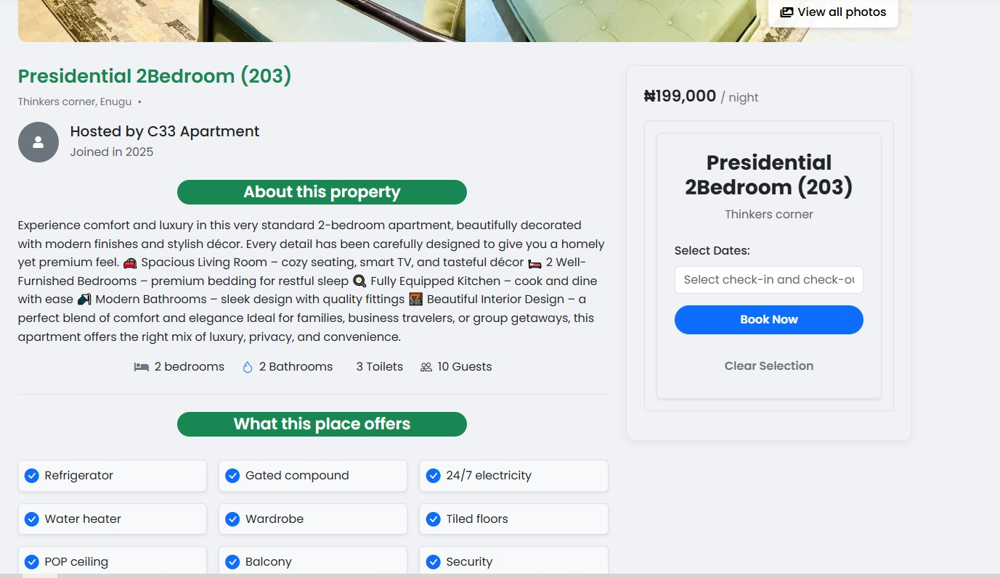
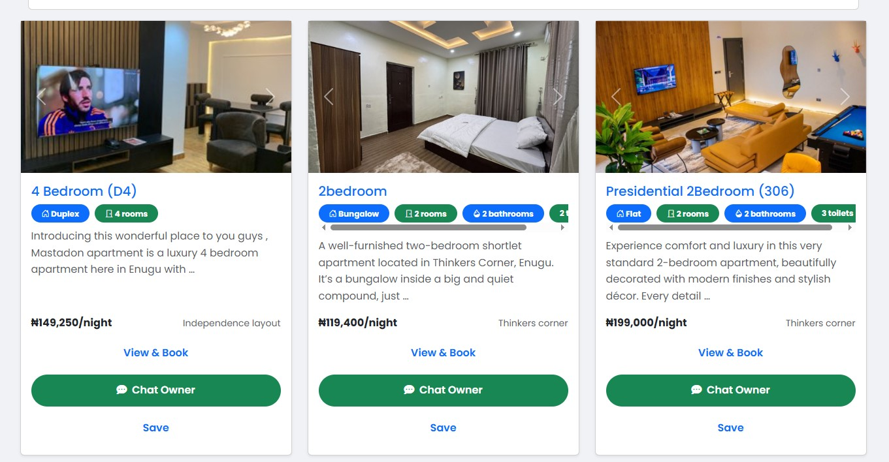
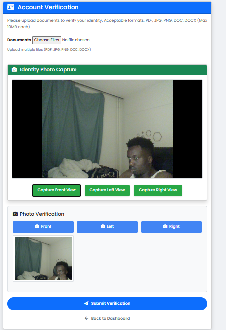
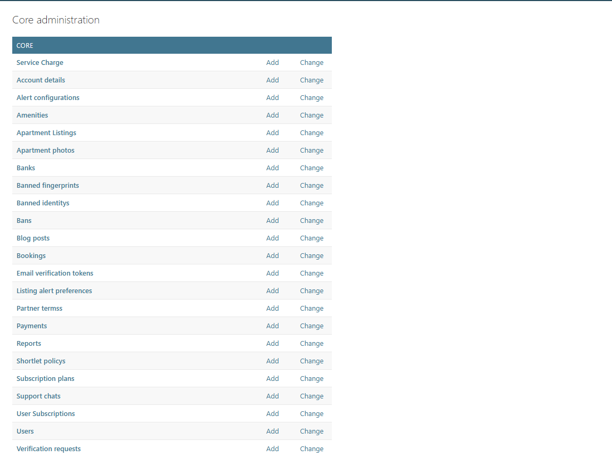
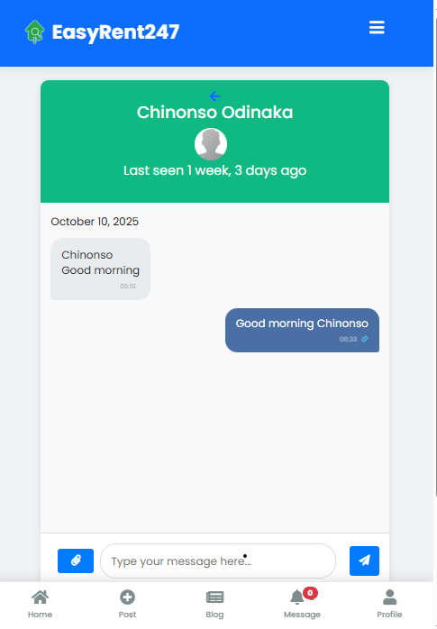
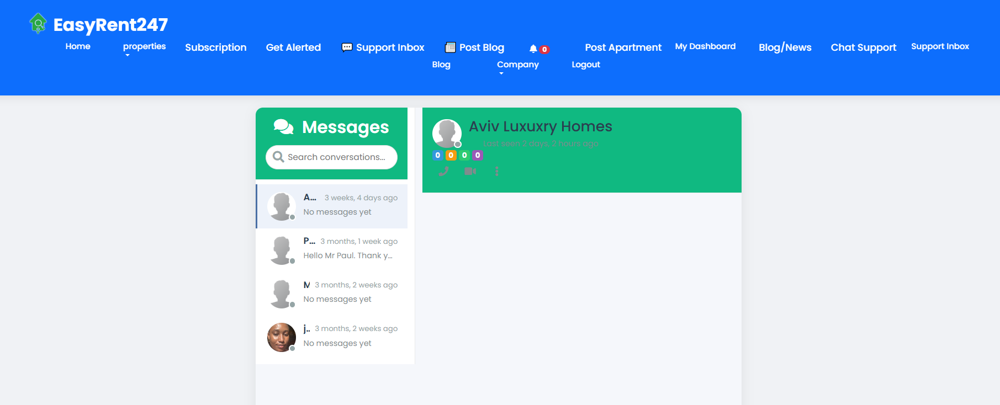
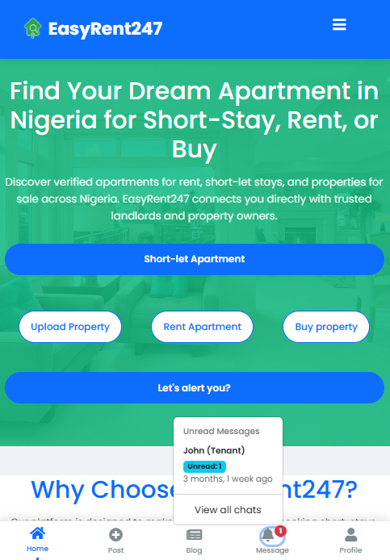

# Short-Let Apartment Web App (Django)

A Django-based web platform that connects tenants with verified short-let apartment owners.

##  Features
- User roles: landlord and tenant
- Apartment listings with photos, prices, and details
- Booking system with automated availability updates
- Favorite listings and past-rental history
- Admin dashboard for property management

##  Tech Stack
- **Backend:** Django, Python  
- **Database:** PostgreSQL  
- **Frontend:** Bootstrap, HTML, CSS  
- **Other:** Celery (for background tasks)

##  Impact
This system streamlined apartment bookings, reducing manual coordination between landlords and tenants by over 70%.

